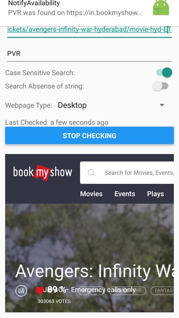

# NotifyAvailability

### Overview

* This app takes input from the user to set up background periodic check of a webpage for a text.
* It creates a background task to notify the user if a text is present on the web page or not.
* This task is executed repeatedly once every ~15 mins depending on the OS.
* It will also show the time check was last made.

#### Input Criteria

* This app asks the user for a `URL` and a `search text`.
* You can also set whether to get notification when search text `is present` on the webpage or when it `is absent`.
* You can set the webpage type to be `desktop` or `mobile` to get different html accordingly.
* You can set the search to be `case sensitive` or `case insensitive`.

### Tech Stack

* React Native
  * react-native-background-fetch
  * react-native-background-task
  * react-native-push-notification
* moment.js

### Testing

* Tested on Android only.
* iOS testing is pending (device unavailable)

### Steps to execute Locally

* You would need android tools and java
* Generate a Key by following: [https://facebook.github.io/react-native/docs/signed-apk-android.html](https://facebook.github.io/react-native/docs/signed-apk-android.html)
* run `yarn` to install dependencies
* run `react-native link` to link the dependencies
* run on connected android device using: `react-native run-android`
* build the signed apks using: `cd android && ./gradlew assembleRelease`

### Use Case

One use case is that we enter the URL of a movie booking website to get notified when it opens booking for a Cinema on the day we want.

