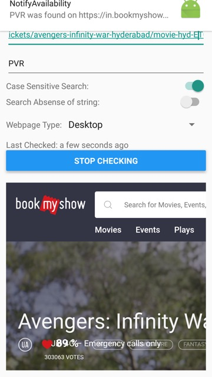

# NotifyAvailability

[](https://github.com/xRahul/NotifyAvailability/blob/master/License.txt)
[](https://github.com/xRahul/NotifyAvailability/releases/latest)

NotifyAvailability watches a webpage for you and posts a local notification when a piece of text appears on it. You pick a URL, the search text, and whether you care about presence or absence; the app re-checks about every 15 minutes in the background until you press Stop. The classic use case: get pinged when a movie booking site finally opens sales for your date.

## Features

- **Background watch** — press Start Checking to schedule a periodic background job (~15-minute cadence) and Stop Checking to cancel it
- **Found or absent** — notifies when the search text shows up by default; the "Search Absence of Text" switch flips that so you hear about disappearance instead (useful for outage or delisting watches)
- **Case-sensitive search** — on by default; the switch turns it off
- **Webpage type** — Mobile, Desktop, or Tablet rendering. Desktop sends a desktop User-Agent on both the background fetch and the in-app preview
- **Last Checked** — timestamp shown as relative time ("5 minutes ago"), or "Never" before any check has run
- **Live preview** — while a watch is active, the page loads in an embedded WebView so you can eyeball what the checker sees
- **Loading indicator** — spins during the first check after Start
- **URL validation** — Start refuses URLs that lack the `http://` / `https://` prefix
- **Auto-resume** — if the app closes while a watch is running, the watch resumes on next launch

## Tech Stack

| Layer                 | Library                                                                                                                                          |
| --------------------- | ------------------------------------------------------------------------------------------------------------------------------------------------ |
| Framework             | React Native 0.87 (React 19.2), TypeScript strict                                                                                                |
| Notifications         | [react-native-notify-kit](https://www.npmjs.com/package/react-native-notify-kit) 10.5                                                            |
| Background scheduling | [react-native-background-fetch](https://www.npmjs.com/package/react-native-background-fetch) 4.4 (JobScheduler-backed periodic fetch on Android) |
| Persistence           | @react-native-async-storage/async-storage 3.1                                                                                                    |
| In-app browser        | react-native-webview 14                                                                                                                          |
| Picker                | @react-native-picker/picker 2.11                                                                                                                 |
| Tooling               | Jest 29 + Testing Library, ESLint, Prettier                                                                                                      |

The 2019 version used `react-native-push-notification` and a JS timer (`react-native-background-timer`). Both are gone: notifications moved to notify-kit and scheduling moved to native background fetch.

## Requirements

- Node.js >= 22.11.0 (enforced via `engines` in package.json)
- Yarn 1.x
- JDK 17 (Android builds)
- Android SDK set up for React Native 0.87

## Getting Started

```sh
yarn install        # dependencies
yarn start          # Metro bundler
yarn android        # build and install on a connected device/emulator
```

### Lint, types, tests

```sh
yarn lint
yarn typecheck
yarn test
```

CI runs all three on Node 22 for every push and pull request (`.github/workflows/ci.yml`).

### Building an APK

```sh
cd android && ./gradlew assembleRelease
```

Release builds currently sign with the debug keystore, so treat the output as a test artifact until production signing lands. The `android-debug.yml` workflow produces a debug APK on manual dispatch, and `android-release.yml` cuts version releases on `v*` tags and republishes the rolling [`latest` pre-release](https://github.com/xRahul/NotifyAvailability/releases/download/latest/app-debug.apk) with a fresh debug APK on every merge to `master`.

## Architecture

```
src/
├── App.tsx                     Composition root: config state, URL validation,
│                               Start/Stop handlers, WebView preview
├── Styles.ts                   Shared StyleSheet
├── constants.ts                Desktop User-Agent string, web platform values
├── types.ts                    WatchConfig shape and defaults
├── utils.ts                    formatRelativeTime and escapeRegExp helpers
├── components/
│   ├── UrlInput.tsx            URL field (memoized)
│   ├── SearchInput.tsx         Search text field (memoized, forwards ref)
│   ├── SettingsSwitch.tsx      Labeled switch: case sensitivity, absence mode
│   └── PlatformPicker.tsx      Mobile/Desktop/Tablet picker
├── services/
│   ├── notificationService.ts  Channel setup and local notifications (notify-kit)
│   ├── checkService.ts         Fetches the page and searches for the text
│   └── watchScheduler.ts       startWatch / stopWatch / resumeWatchIfNeeded
│                               over react-native-background-fetch
└── storage/
    └── configStorage.ts        loadWatchConfig / saveWatchConfig over AsyncStorage
```

App.tsx loads the persisted config on launch, resumes a running watch if there was one, and wires the memoized components to `saveWatchConfig`. Services own everything native: notifications, page checks, and the periodic schedule.

Storage keys have not changed since the 2019 app (`url`, `searchText`, `taskSet`, `webPlatformType`, `lastChecked`, `caseSensitiveSearch`, `searchAbsence`, with `yes`/`no` values), so existing installs upgrade with zero migration.

## Known Quirks

- **Tablet behaves like Mobile** — Tablet uses the same default User-Agent as Mobile; there is no tablet-specific one. Kept as-is to match the original app.
- **Background cadence belongs to the OS** — Android's job scheduler enforces a 15-minute minimum interval and batches jobs under Doze, so checks can land later than the nominal ~15 minutes.
- **Notification permission prompt** — the first Start triggers it. Notifications post to the channel id `availability`.
- **iOS is a scaffold stub** — never built (`pod install` has not been run); `yarn ios` exists in package.json but expect nothing from it.
- **Debug-keystore release signing** — production signing is deferred (see above).

## Use Case

One use case: enter the URL of a movie booking website and get notified when it opens booking for a Cinema on the day you want.


