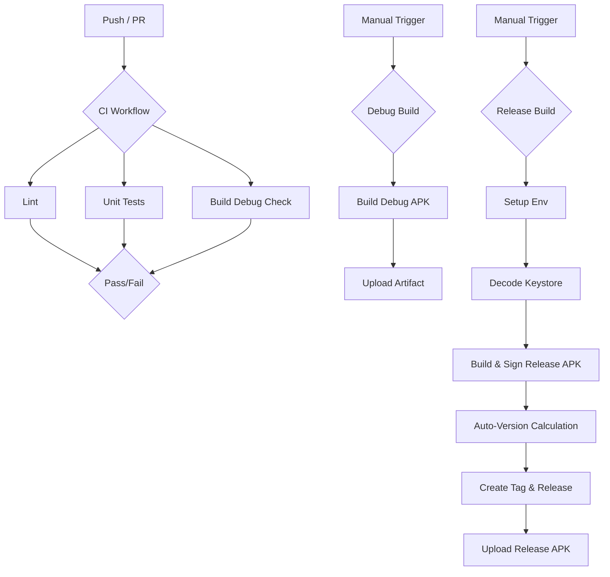

# Product Requirements Document (PRD): CI/CD Pipeline

## Overview
The goal is to establish a robust, enterprise-grade CI/CD pipeline for the `notify-availability` React Native Android project. This pipeline will ensure code quality, automate testing, and streamline the release process for debug and production builds.

## Requirements

### 1. Continuous Integration (CI)
*   **Trigger:** Pushes to `main`/`master` and all Pull Requests.
*   **Checks:**
    *   Linting (ESLint).
    *   Unit Tests (Jest).
    *   Build Integrity (Compile Debug APK).

### 2. Manual Debug Build
*   **Trigger:** Manual dispatch (`workflow_dispatch`).
*   **Output:** Debug APK artifact available for download (7-day retention).

### 3. Release Pipeline
*   **Trigger:** Manual dispatch (`workflow_dispatch`).
*   **Security:** Secure signing using encrypted keystore.
*   **Versioning:** Automated Semantic Versioning (Patch increment).
*   **Output:**
    *   Signed Release APK.
    *   GitHub Release with tagged version.

## Pipeline Flow

