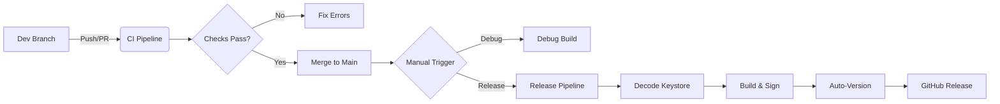

# Product Requirements Document (PRD) - CI/CD Pipeline

## 1. Overview
This document outlines the requirements for implementing an enterprise-grade CI/CD pipeline for the `notify-availability` Android application (React Native). The goal is to automate testing, building, and releasing to ensure code quality and streamline deployment.

## 2. Requirements

### 2.1. Continuous Integration (CI)
*   **Trigger:** Pushes to `main`/`master` branches and all Pull Requests.
*   **Jobs:**
    *   **Linting:** Verify code style and potential errors using `yarn lint`.
    *   **Unit Testing:** Execute unit tests using `yarn test`.
    *   **Build Verification:** Compile a Debug APK to ensure the codebase builds successfully (`./gradlew assembleDebug`).
*   **Environment:**
    *   Node.js (v16) for React Native environment.
    *   Java 11 for Android build compatibility.

### 2.2. Manual Debug Build
*   **Trigger:** Manual (`workflow_dispatch`).
*   **Job:** Build a Debug APK.
*   **Artifacts:** Upload the generated `app-debug.apk` with a 7-day retention period for manual testing.

### 2.3. Release Pipeline
*   **Trigger:** Manual (`workflow_dispatch`).
*   **Security:**
    *   Use GitHub Secrets for Keystore credentials (`KEY_ALIAS`, `KEY_PASSWORD`, `KEY_STORE_PASSWORD`, `KEY_STORE_BASE64`).
    *   Decode `KEY_STORE_BASE64` securely during the build process.
*   **Build & Sign:**
    *   Build a Release APK (`./gradlew assembleRelease`).
    *   Sign the APK using the decoded keystore and credentials passed as Gradle properties.
*   **Versioning:**
    *   Implement Semantic Versioning (SemVer).
    *   Automatically calculate the next Patch version (e.g., 1.0.0 -> 1.0.1) based on existing Git tags.
    *   Default to `1.0.0` if no tags exist.
*   **Release:**
    *   Create a Git Tag (e.g., `v1.0.1`).
    *   Create a GitHub Release.
    *   Upload the Signed Release APK as an asset.

## 3. Pipeline Flow

