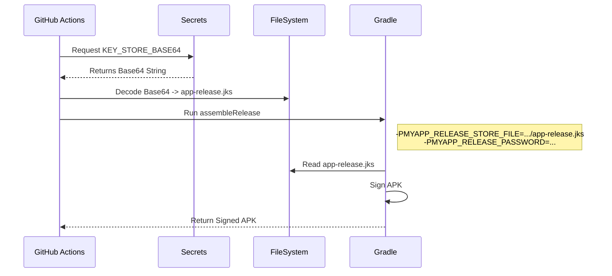

# Technical Design (TD): GitHub Actions CI/CD

## Architecture
The CI/CD pipeline is built using GitHub Actions, leveraging reusable workflows and standard actions.

### Workflows
1.  **`ci.yml`**: Focuses on code quality and build stability. Runs on every commit to main branches and PRs.
2.  **`manual_debug.yml`**: Allows developers to generate an installable Debug APK on demand without local environment setup.
3.  **`release.yml`**: Handles the production release process, including signing, versioning, and publishing.

## Secret Management
We use GitHub Actions Secrets to store sensitive signing credentials.
*   `KEY_ALIAS`: The alias of the key in the keystore.
*   `KEY_PASSWORD`: The password for the key.
*   `KEY_STORE_PASSWORD`: The password for the keystore.
*   `KEY_STORE_BASE64`: The base64-encoded content of the `.jks` keystore file.

### Keystore Decoding Process
During the release build:
1.  The `KEY_STORE_BASE64` secret is retrieved.
2.  It is decoded using `base64 -d` into a temporary file (e.g., `app-release.jks`).
3.  The path to this file and the passwords are passed to Gradle via command-line project properties (`-P`).

### Secret Generation
To generate the `KEY_STORE_BASE64` secret, run this PowerShell command:
```powershell
[Convert]::ToBase64String([IO.File]::ReadAllBytes('app-release.jks'))
```

## Semantic Versioning Logic
The release workflow automatically calculates the next version number:
1.  Fetch all git tags.
2.  Find the latest tag matching `v*.*.*`.
3.  If found (e.g., `v1.0.0`), increment the patch version (to `v1.0.1`).
4.  If not found, default to `v1.0.0`.
5.  This version is used for the Git Tag and the GitHub Release name.

## Signing Process Sequence


