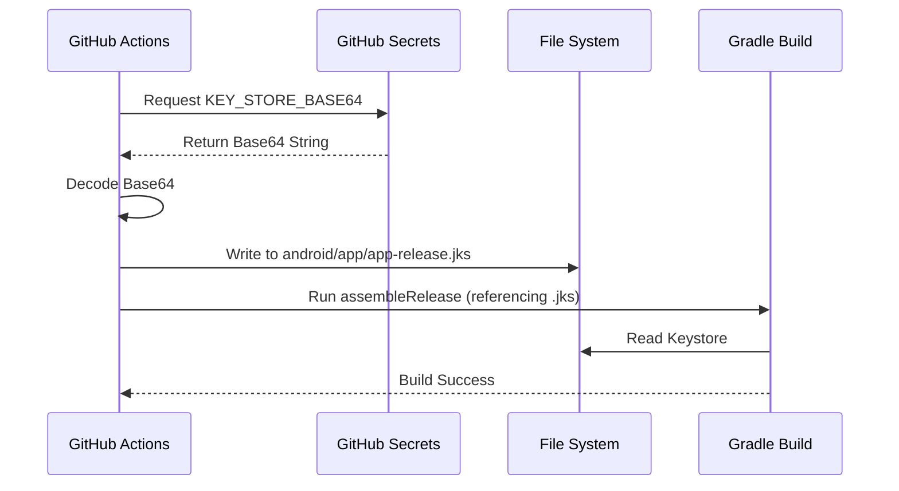

# Technical Design (TD) - CI/CD Implementation

## 1. Architecture
The CI/CD pipeline is implemented using **GitHub Actions**, leveraging workflows defined in YAML files within `.github/workflows/`.

*   **Runners:** `ubuntu-latest` is used for all jobs to ensure a consistent Linux environment.
*   **Environment Setup:**
    *   `actions/setup-node`: Configured for Node.js v16 to support the React Native toolchain.
    *   `actions/setup-java`: Configured for Java 11 (Temurin) to match the Gradle 5.5 and Android Gradle Plugin requirements.
*   **Caching:**
    *   `gradle/actions/setup-gradle`: Handles Gradle caching to speed up builds.
    *   `yarn`: Node modules caching is handled implicitly by `setup-node` or manually if needed (using `setup-node`'s cache feature).

## 2. Workflows

### 2.1. CI (`ci.yml`)
Runs on `push` to main branches and `pull_request`.
*   **Lint:** `yarn lint` (ESLint).
*   **Test:** `yarn test` (Jest).
*   **Build:** `cd android && ./gradlew assembleDebug`.

### 2.2. Manual Debug (`manual_debug.yml`)
Triggered manually via `workflow_dispatch`.
*   Builds `assembleDebug`.
*   Uploads artifact using `actions/upload-artifact` with 7-day retention.

### 2.3. Release (`release.yml`)
Triggered manually via `workflow_dispatch`.
*   **Secret Injection:** Uses `secrets.KEY_STORE_BASE64` and related password secrets.
*   **Keystore Management:** The Base64 encoded keystore is decoded into a temporary file (`android/app/app-release.jks`) only during the build job and cleaned up afterwards (ephemeral runner).
*   **Build Command:**
    ```bash
    cd android && ./gradlew assembleRelease \
      -PMYAPP_RELEASE_STORE_FILE=app-release.jks \
      -PMYAPP_RELEASE_STORE_PASSWORD=${{ secrets.KEY_STORE_PASSWORD }} \
      -PMYAPP_RELEASE_KEY_ALIAS=${{ secrets.KEY_ALIAS }} \
      -PMYAPP_RELEASE_KEY_PASSWORD=${{ secrets.KEY_PASSWORD }}
    ```

## 3. Secret Management Strategy
To secure the Android Keystore (`.jks` file), we do not commit it to the repository. Instead, we encode it as a Base64 string and store it as a GitHub Secret.

### 3.1. Keystore Decoding Flow



### 3.2. Secret Generation
To generate the `KEY_STORE_BASE64` secret from your local `.jks` file, run this PowerShell command:

```powershell
[Convert]::ToBase64String([IO.File]::ReadAllBytes('app-release.jks'))
```

*Copy the output string and paste it into GitHub Repository Settings > Secrets > Actions.*

## 4. Semantic Versioning Logic
The pipeline automatically manages versions for releases.
1.  **Fetch Tags:** `git fetch --tags` retrieves existing release tags.
2.  **Calculate Next Version:**
    *   Extract the latest tag (e.g., `v1.0.2`).
    *   Split the version string.
    *   Increment the PATCH number (last segment).
    *   Example: `v1.0.2` -> `1.0.3`.
    *   If no tags exist, default to `1.0.0`.
3.  **Apply Version:** The new version is used for the Git Tag and the GitHub Release name. Note: The Android `versionName` in `build.gradle` is not automatically modified in source control to avoid commit noise, but can be overridden via Gradle properties if desired (currently manual in `build.gradle`).
